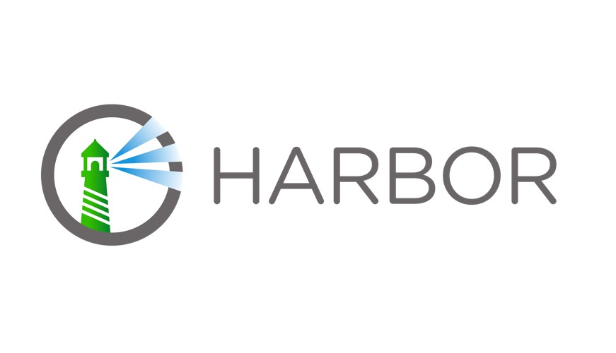

# harbor installation shell

- This shell script can install harbor for kubernetes
- [More details here!](https://goharbor.io/docs/1.10/install-config/)

## Requirements
- kubernetes(k3s, minikube, or etc,. are also compatible)
- helm
- You can install `K3S` [here](https://github.com/sunjin7725/k3s-installation-shell)!
- You can install `Helm` [here](https://github.com/sunjin7725/helm-installation-shell)!

## Installation
This installation shell provide only default setting!!! 
```bash
chmod +x harbor.sh

./harbor.sh
```
**Note**  
1) Please check cert-manager release available version 
[cert-manager release](https://github.com/cert-manager/cert-manager/tags)  
1) Cert-manager installation has to set version parameter